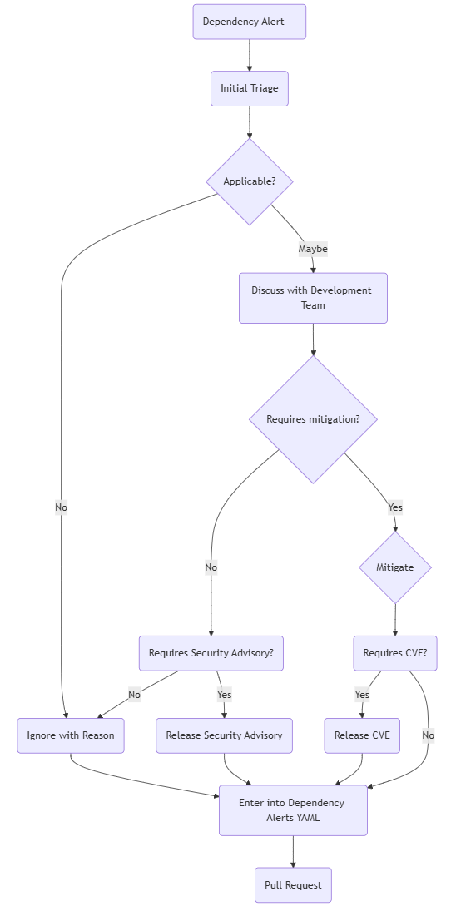

### Product Security Incident Response Process

Various inputs will enter items for consideration into this process.  These will include dependency vulnerability monitoring, external security researchers, internal development resources, and others.  The specific processes used in the monitoring of potential security issues and vulnerabilities within the software development lifecycle will change over time, and are not enumerated by the process.

**Scope:**  This process will manage the product security of the OpenZiti organization and NetFoundry software.  OpenZiti includes the core components and derivative products, such as zrok and browZer which are also developed within the organization, as well as third party vulnerabilities discovered in dependencies not in the scope of other CVE Numbering Authorities.  This scope will not extend to end of life or end of support products.

Upon receiving the potential vulnerability information, the first step is to assess the severity and potential impact of any exploitation of the vulnerability.   In assessing the potential impact, we must determine if there is any impact.  To designate a reported vulnerability as no impact and therefore not applicable, clear reasoning must be applied that proves to a reasonable and competent person that there is no path of exploitation of the vulnerability in the software as released.  For example, the OpenZiti repository v1.1.15 contains a dependency for disintegration/imaging v1.6.2 (indirectly).  Github's Dependabot process has reported a vulnerability in this package indicating a possible panic due to a crafted TIFF file being processed.  There is no interface in the software to initiate the processing of an image file, therefore there is no way in which this vulnerability could be exploited once the software is deployed.   

Once any impact is suspected, the vulnerability will be discussed with  the relevant development team as well as Security to determine possible exploitation paths and the values of the CVSS entries to determine a score.  This discussion may lead to a conclusion that the vulnerability is not exploitable, or develop a set of required mitigation actions.  

If the vulnerability is in a dynamically linked dependency, which can be updated by the customer independently, no CVE will be issued, but rather a security advisory.  This advisory will indicate to the customer the potential impact, the required dependency update, and the tested versions of the software with that dependency updated.  The security advisory will be distributed via the open source communities' best current methods, as well as by email or other appropriate channels to all current NetFoundry customers.  See Appendix A for an example Security Advisory

If a vulnerability is exploitable and cannot be mitigated by other methods than an update of NetFoundry or OpenZiti software, a CVE release is required.  CVEs should not be released until the software including the proper mitigations is available.  This may require a slight release delay and coordination between the NetFoundry and OpenZiti software release processes.  The elapsed time between the release of the updated OpenZiti software and CVE and the availability of the version within the NetFoundry systems should be kept to an absolute minimum.

Reference the current MITRE template for CVE reporting to the appropriate CVE Numbering Authority level.

https://cve.mitre.org/cve/list_rules_and_guidance/cve_assignment_information_format.html

Security advisories and CVE's will be distributed in multiple channels. Security advisories and CVE notifications will be posted in the current community forums, for example Discourse, placed in the release notes, and if the vulnerability addressed is a critical or high level, a notice should be placed on the main GitHub page of the OpenZiti project for no less than 30 days.

Process Flowchart

- Dependency Alert -  Alerts may come from various feeds, such as Github's Dependabot, Sonar, or other tools applied to the development environments, and each will have an appropriate process for visibility, for example a posting to internal communication channels, or a regularly reviewed report.

- Initial Triage - Initial review of the vulnerability will be assigned per project.  It may be performed by the Security or Development teams, though the Security Team is responsible to ensure the process is functioning.

- Ignore with Reason - Any vulnerability that is ignored will be noted with a reason in an appropriate location.  In the case of open source repositories, they will be noted in the project's security folder for visibility.  Internal repositories may be noted similarly, or within the tool infrastructure as appropriate.  

- Discuss with Development Team - The team performing the initial triage will follow up with the appropriate development team if they are unable to clearly and definitively determine the vulnerabiliiy's applicability on their own.

- Requires Mitigation - The development team will determine if the vulnerability requires mitigation or not.  If the vulnerability is not applicable, it is ignored with reason.  If yes, the appropriate steps are planned and the mitigation is completed.

- Requires CVE - If the software is distributed to customers and/or the open source community, a CVE should be issues, per the CVE release procedure.  If the software is completely internal, a CVE is not required.

- Release CVE - If the software is distributed, a CVE release will be initiated per the CVE release policy and procedure.

- Requires Security Advisory - If the issue can be resolved without a release of any OpenZiti or NetFoundry software components, for example by upgrading a dynamically linked library from a third party source, a security advisory may be needed, rather than a CVE

- Release Security Advisory - If a security advisory is required, refer to the Product Security Incident Response Plan for details.

- Document Dependency Vulnerability - All vulnerabilities will be noted in the appropriate location.  For internal systems this may be in a security folder of the project, or the vulnerability scanning tooling itself, as appropriate.  All vulnerabilities in open source projects will be noted in the security folder files of the repository for public visibility.  The release of the vulnerability information will follow the timeline of the CVE process, only being released once the mitigation is completed.

- Pull request - The normal Pull Request process will be followed regardless of the outcome, ignored or mitigated.  If ignored, there is no specific timeline to the PR process, it will be released with the next software release. If a vulnerability of medium or higher severity is mitigated by a release, that release should be completed as soon as possible.  Vulnerabilities mitigated should be noted in the release notes, referring to the appropriate files for more details.

